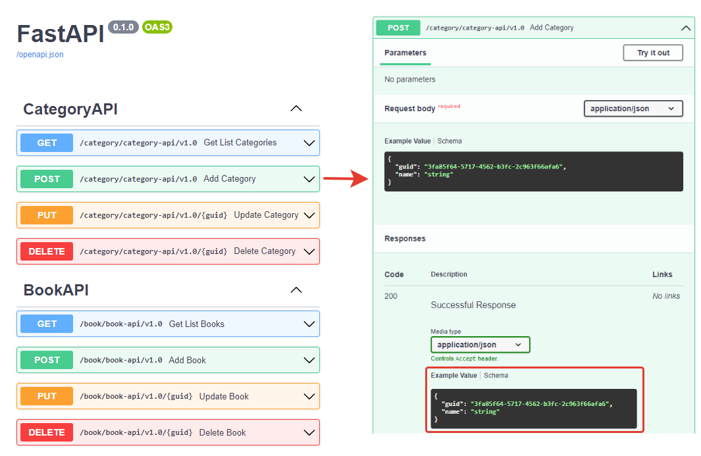

# Generics

## In previous section

In the previous section, we implemented our application using classes. Got rid of the repetition of dependencies.

A <u>simplified</u> example of the work done:

```python hl_lines=""
{!./src/first_steps/create_controller_simplified_app.py!}
```

The presented code uses classes, but does not have many advantages over the standard FastAPI.
It only allows you to get rid of duplicate dependencies.

**The real magic is ahead...**

## Generics and inheritance

Let's get rid of duplications of the same type of database operations and use `Generic`.

To use the `Generic`, you need to do the following:

- **#0:** Import the `Generic` and `TypeVar` class.
- **#1:** Create generic types to create generic endpoints.
- **#2:** Create generic base API controller (class).
- **#3:** Change the endpoint according to the example.
- **#4:** Inherit controllers from generic controller.
- **#5:** Include all your controllers (endpoints) in the router.

```python hl_lines="2 31 32 35 38 39 45 46 50 56 58 64 66 77 82 86 87"
{!./src/generics/crud_books.py!}
```

The OpenAPI Specification looks like this:



<figure markdown>
  <figcaption><b>It`s Magic</b></figcaption>
  { width="300" }
</figure>


An example of the project is available at the link: #TODO: добавить ссылку
